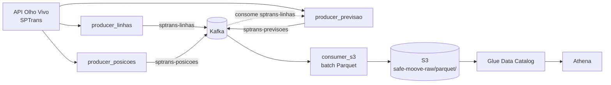

# SafeMoove

Pipeline de dados em tempo real da frota de ônibus de São Paulo: extrai dados públicos da API Olho Vivo (SPTrans), transmite via Kafka e persiste em S3 como Parquet particionado, pronto para consulta analítica via AWS Athena/Glue.

Construído para responder duas perguntas de negócio:

1. **Quais linhas têm maior atraso?**
2. **Quantos ônibus rodam por dia, por tipo de linha?**

## Sumário

- [Arquitetura](#arquitetura)
- [Pré-requisitos](#pré-requisitos)
- [Configuração](#configuração)
- [Como rodar](#como-rodar)
- [Estrutura do projeto](#estrutura-do-projeto)
- [Modelo de dados](#modelo-de-dados)
- [Camada de analytics (Athena/Glue)](#camada-de-analytics-athenaglue)
- [Limitações conhecidas](#limitações-conhecidas)
- [Troubleshooting](#troubleshooting)

## Arquitetura



- **3 producers** publicam em tópicos Kafka próprios, cada um lendo de um endpoint diferente da API Olho Vivo.
- **1 consumer** (`consumer_s3`) lê todos os tópicos, agrupa mensagens em memória por tópico e grava lotes como arquivos Parquet no S3 — não um arquivo por mensagem.
- Todo o código Python roda na mesma imagem Docker; cada serviço no `docker-compose.yml` só troca o comando de entrada.

## Pré-requisitos

- Docker + Docker Compose
- Um token da API Olho Vivo (SPTrans) — solicitação gratuita em [sptrans.com.br/desenvolvedores](http://www.sptrans.com.br/desenvolvedores/)
- Uma conta AWS com um bucket S3 já existente e credenciais com permissão de escrita nele
- (Opcional, para consulta) permissão de Glue + Athena na mesma conta

## Configuração

Copie o arquivo de exemplo e preencha com valores reais:

```bash
cp .env.example .env
```

Variáveis obrigatórias: `SafeMooveTOKENolhovivo`, `AWS_ACCESS_KEY_ID`, `AWS_SECRET_ACCESS_KEY`, `AWS_DEFAULT_REGION`. As demais são opcionais — o `.env.example` documenta cada uma com seu valor padrão.

## Como rodar

### Via Docker Compose (recomendado)

```bash
docker compose up --build -d
```

Isso sobe, nessa ordem: Zookeeper → Kafka → criação dos tópicos → os 3 producers → o consumer. `producer_linhas` roda uma descoberta completa por padrão (pode levar horas — use `LINHAS_MAX_ENCONTRADAS` no `.env` para limitar durante testes). `producer_posicoes` e `producer_previsao` rodam em loop indefinido.

Para parar de forma graciosa (o `consumer_s3` grava qualquer lote pendente antes de sair):

```bash
docker compose stop
docker compose down
```

Ver logs de um serviço específico:

```bash
docker compose logs -f producer-previsoes
```

### Localmente, sem Docker

```bash
pip install -r requirements.txt
python run_pipeline.py   # sobe os 3 producers como subprocessos
```

Nesse modo você precisa de um Kafka acessível (`KAFKA_BOOTSTRAP_SERVERS`) e rodar `consumer/consumer_s3.py` separadamente. Pensado para debug rápido, não para produção.

### Criar os tópicos manualmente

Normalmente feito pelo serviço `create-topics` do compose, mas pode ser rodado à parte:

```bash
python -m scripts.create_topics
```

## Estrutura do projeto

```
SafeMoove/
├── docker-compose.yml       # orquestra Zookeeper, Kafka, producers e consumer
├── Dockerfile                # imagem única compartilhada por todos os serviços Python
├── requirements.txt           # dependências Python
├── run_pipeline.py            # alternativa ao compose: sobe os 3 producers localmente
├── .env.example                # template de variáveis de ambiente (sem segredos)
│
├── producer/
│   ├── __init__.py            # vazio de propósito — ver nota abaixo
│   ├── api_sptrans.py          # client HTTP único para a API Olho Vivo
│   ├── producer_linhas.py      # descobre linhas ativas -> tópico sptrans-linhas
│   ├── producer_posicoes.py    # posição de todos os veículos -> sptrans-posicoes
│   └── producer_previsao.py    # previsão de chegada por linha -> sptrans-previsoes
│
├── consumer/
│   ├── __init__.py
│   └── consumer_s3.py          # Kafka -> Parquet em lote -> S3
│
├── shared/
│   ├── __init__.py
│   ├── aws_config.py           # client S3 (boto3)
│   ├── kafka_config.py         # factory de producer/consumer Kafka
│   ├── logger.py               # logging padronizado (usado em todo o projeto)
│   ├── schemas.py              # schema pyarrow fixo por tópico
│   └── topics.py               # tópico Kafka -> pasta S3 -> nº de partições
│
└── scripts/
    └── create_topics.py        # cria os tópicos Kafka a partir de shared/topics.py
```

### O que cada arquivo faz, em detalhe

**`producer/api_sptrans.py`** — `SPTransAPI`, a única classe que fala com `api.olhovivo.sptrans.com.br`. Autentica uma vez no `__init__` e mantém a sessão (cookie) para as chamadas seguintes. Sessão configurada com retry/backoff automático (3 tentativas, incluindo em falha de autenticação). Métodos: `buscar_linhas(termo)`, `obter_codigo_linha(linha)`, `obter_previsao(codigo_linha)`, `obter_posicoes()`. Todos os producers instanciam essa classe em vez de reimplementar autenticação.

**`producer/producer_linhas.py`** — a API Olho Vivo não tem endpoint "listar todas as linhas", só busca por termo. Este producer faz uma descoberta por força bruta: começa com ~10.000 termos numéricos + prefixos de letra, e expande a busca com os letreiros que vai encontrando. Publica cada linha encontrada (código, letreiro, sentido, tipo, origem, destino) em `sptrans-linhas`. `LINHAS_MAX_ENCONTRADAS` permite interromper cedo (útil para testes; em produção, deixe sem limite).

**`producer/producer_posicoes.py`** — usa o endpoint `/Posicao`, que retorna a posição de **todos os veículos de todas as linhas em uma única chamada**. Achata a resposta (que vem aninhada por linha) em uma mensagem por veículo observado, publicada em `sptrans-posicoes`. Roda em loop a cada `POSICOES_POLL_INTERVAL` segundos.

**`producer/producer_previsao.py`** — o endpoint `/Previsao/Linha` só existe por linha (sem versão "todas as linhas"), então este producer consome o tópico `sptrans-linhas` para descobrir dinamicamente quais linhas existem, e cicla uma chamada de previsão por linha. Cada resposta vem aninhada (parada → lista de veículos previstos); é achatada em uma mensagem por par (parada, veículo previsto), publicada em `sptrans-previsoes`. A lista de linhas conhecidas é atualizada periodicamente (`PREVISOES_REFRESH_INTERVAL`) para pegar linhas novas sem reiniciar o processo.

**`producer/__init__.py`** — **propositalmente vazio**. Um bug já corrigido neste projeto: se esse arquivo importar os módulos `producer_*.py`, o Python executa esses imports (e todo o código de nível de módulo neles) sempre que qualquer submódulo do pacote é importado — inclusive ao rodar `python -m producer.producer_previsao`, isso cascatearia para rodar todos os outros producers primeiro. Por isso cada `producer_*.py` também guarda sua lógica atrás de `if __name__ == "__main__":`.

**`consumer/consumer_s3.py`** — consome os 3 tópicos com um único `KafkaConsumer` (`enable_auto_commit=False`). Mantém um buffer em memória por tópico; quando um buffer atinge `S3_BATCH_SIZE` registros ou `S3_BATCH_INTERVAL_SECONDS` desde o último flush (o que vier primeiro), grava esse buffer como **um único arquivo Parquet** em `s3://{bucket}/parquet/{topico}/ano=YYYY/mes=MM/dia=DD/{timestamp}.parquet`, usando o schema fixo de `shared/schemas.py`. Só então confirma (`commit`) o offset das partições daquele tópico especificamente — nunca um `commit()` genérico, que arriscaria avançar a posição de outro tópico com buffer ainda não gravado. Trata `SIGTERM`/`SIGINT` fazendo flush de qualquer buffer pendente antes de encerrar (importante para `docker compose stop` não perder dados).

**`shared/schemas.py`** — schema `pyarrow` explícito por tópico. Existe para que todos os arquivos Parquet de um mesmo tópico tenham exatamente as mesmas colunas/tipos — sem isso, o `pyarrow`/pandas infere tipos por lote, e uma inconsistência entre arquivos quebra leitura no Athena.

**`shared/topics.py`** — fonte única de verdade para: quais tópicos existem, para qual pasta do S3 cada um vai, e quantas partições Kafka cada um tem. Usado tanto por `create_topics.py` quanto por `consumer_s3.py`.

**`shared/kafka_config.py`** — `get_producer()` e `get_consumer(topics, group_id, enable_auto_commit)`. Bootstrap server configurável via `KAFKA_BOOTSTRAP_SERVERS` (default `kafka:9092`, resolve dentro da rede do compose).

**`shared/logger.py`** — `get_logger(name)`, logging padronizado (timestamp, nível, nome do módulo) usado em todo o projeto em vez de `print`.

## Modelo de dados

Todos os tópicos são gravados como Parquet particionado por `ano=/mes=/dia=` (UTC, sempre 2 dígitos em mês/dia).

### `sptrans-linhas` → `parquet/linhas/`
| Campo | Tipo | Descrição |
|---|---|---|
| `codigo_linha` | bigint | identificador único da linha na API |
| `circular` | boolean | linha circular (sem terminal de retorno) |
| `letreiro` | string | número/letreiro exibido no ônibus |
| `sentido` | bigint | 1 = ida, 2 = volta |
| `tipo` | bigint | classificação da linha pela SPTrans |
| `origem` / `destino` | string | terminais |

### `sptrans-posicoes` → `parquet/posicoes/`
| Campo | Tipo | Descrição |
|---|---|---|
| `horario_consulta` | string | horário (HH:MM) da resposta da API |
| `timestamp_veiculo` | string | timestamp ISO 8601 do GPS do veículo |
| `codigo_linha` | bigint | FK para `linhas.codigo_linha` |
| `letreiro`, `sentido`, `origem`, `destino` | — | replicados da linha, para consulta sem join |
| `prefixo_veiculo` | string | identificador do veículo físico |
| `acessivel` | boolean | veículo acessível |
| `latitude` / `longitude` | double | posição GPS no instante da consulta |

### `sptrans-previsoes` → `parquet/previsoes/`
| Campo | Tipo | Descrição |
|---|---|---|
| `horario_consulta` | string | horário (HH:MM) da resposta |
| `codigo_linha` | bigint | FK para `linhas.codigo_linha` |
| `codigo_parada` | bigint | identificador da parada |
| `nome_parada`, `latitude_parada`, `longitude_parada` | — | dados da parada, embutidos (sem precisar de tabela separada) |
| `prefixo_veiculo` | string | veículo para o qual essa previsão vale |
| `horario_previsto` | string | horário estimado de chegada (HH:MM) |
| `timestamp_previsao` | string | timestamp ISO 8601 de quando a previsão foi gerada |
| `latitude_veiculo` / `longitude_veiculo` | double | posição do veículo no momento da previsão |

**Nota:** a API não expõe horário programado (schedule), só previsão em tempo real. "Atraso" não é um campo direto — é derivado comparando como `horario_previsto` muda para o mesmo (linha, parada, veículo) entre leituras sucessivas (ver [Limitações](#limitações-conhecidas)).

## Camada de analytics (Athena/Glue)

O S3 já está organizado em partições Hive-style (`ano=/mes=/dia=`), compatível nativamente com Athena. Abordagem recomendada: um database no Glue Data Catalog (`safemoove`) com uma tabela externa por tópico, usando **partition projection** (evita `MSCK REPAIR TABLE` a cada novo dia de dados) — exemplo para `linhas`:

```sql
CREATE EXTERNAL TABLE safemoove.linhas (
  codigo_linha bigint, circular boolean, letreiro string,
  sentido bigint, tipo bigint, origem string, destino string
)
PARTITIONED BY (ano int, mes int, dia int)
STORED AS PARQUET
LOCATION 's3://<bucket>/parquet/linhas/'
TBLPROPERTIES (
  'projection.enabled' = 'true',
  'projection.ano.type' = 'integer', 'projection.ano.range' = '2024,2030',
  'projection.mes.type' = 'integer', 'projection.mes.range' = '1,12', 'projection.mes.digits' = '2',
  'projection.dia.type' = 'integer', 'projection.dia.range' = '1,31', 'projection.dia.digits' = '2',
  'storage.location.template' = 's3://<bucket>/parquet/linhas/ano=${ano}/mes=${mes}/dia=${dia}/'
);
```

Repita para `posicoes` e `previsoes` (colunas conforme [Modelo de dados](#modelo-de-dados)). O IAM usado precisa de `glue:CreateDatabase/CreateTable`, `athena:StartQueryExecution/GetQueryExecution/GetQueryResults`, e leitura/escrita nos buckets de dados e de resultados do Athena.

## Limitações conhecidas

- **"Atraso" é um proxy, não uma métrica direta.** Sem horário programado exposto pela API, a única forma de estimar atraso é observar se `horario_previsto` para o mesmo veículo/parada vai empurrando pra frente ao longo de leituras sucessivas. Um cálculo mais rigoroso exigiria cruzar com o GTFS estático da SPTrans como referência de horário programado — não implementado.
- **Descoberta de linhas é força bruta.** Sem endpoint "listar tudo", a cobertura completa depende de rodar `producer_linhas` sem `LINHAS_MAX_ENCONTRADAS`, o que leva horas.
- **Semântica at-least-once.** Se a gravação no S3 tiver sucesso mas o processo cair antes do commit do offset, o próximo restart reprocessa esse lote — pode gerar duplicatas (até um batch inteiro no pior caso). Deduplicação, se necessária, fica por conta da camada de consulta.
- **Não há endpoint de velocidade** na API pública Olho Vivo — um producer anterior que tentava usar `/Velocidade` foi removido após confirmar 404 em produção.

## Troubleshooting

| Sintoma | Causa provável |
|---|---|
| `Falha na autenticação SPTrans` | Token inválido/expirado em `SafeMooveTOKENolhovivo` |
| `producer_previsao` fica em "Aguardando linhas publicadas..." indefinidamente | `producer_linhas` ainda não publicou nada (força bruta é lenta no início) ou não está rodando |
| Query no Athena retorna 0 linhas mesmo com dados no S3 | Checar se `projection.mes.digits`/`projection.dia.digits` = `2` — os arquivos são gravados com zero à esquerda (`mes=08`), sem isso a projection gera caminhos que não existem |
| `consumer_s3` loga erro de escrita e não avança offset | Comportamento esperado — a mensagem será reprocessada no próximo restart, não foi perdida |
