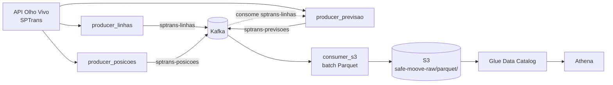

# SafeMoove

Pipeline de dados em tempo real da frota de ônibus de São Paulo. Extrai dados públicos da API Olho Vivo (SPTrans), transmite via Kafka e persiste em S3 como Parquet particionado, pronto para consulta via AWS Athena/Glue.

Construído para responder duas perguntas de negócio:

1. Quais linhas têm maior atraso?
2. Quantos ônibus rodam por dia, por tipo de linha?

## Sumário

- [Arquitetura](#arquitetura)
- [Pré-requisitos](#pré-requisitos)
- [Configuração](#configuração)
- [Como rodar](#como-rodar)
- [Estrutura do projeto](#estrutura-do-projeto)
- [Modelo de dados](#modelo-de-dados)
- [Camada de analytics (Athena/Glue)](#camada-de-analytics-athenaglue)
- [Limitações conhecidas](#limitações-conhecidas)
- [Troubleshooting](#troubleshooting)

## Arquitetura



- 3 producers, cada um lendo um endpoint diferente da API Olho Vivo e publicando em seu próprio tópico Kafka.
- 1 consumer (`consumer_s3`) lê todos os tópicos e grava em lote no S3 como Parquet — não um arquivo por mensagem.
- Toda a aplicação roda na mesma imagem Docker; cada serviço do `docker-compose.yml` só troca o comando de entrada.

## Pré-requisitos

- Docker + Docker Compose
- Token da API Olho Vivo (SPTrans) — solicitação gratuita em [sptrans.com.br/desenvolvedores](http://www.sptrans.com.br/desenvolvedores/)
- Conta AWS com bucket S3 existente e credenciais com permissão de escrita nele
- Opcional, para consulta: permissão de Glue + Athena na mesma conta

## Configuração

```bash
cp .env.example .env
```

Obrigatórias: `SafeMooveTOKENolhovivo`, `AWS_ACCESS_KEY_ID`, `AWS_SECRET_ACCESS_KEY`, `AWS_DEFAULT_REGION`. As demais são opcionais — o `.env.example` documenta cada uma com seu default.

## Como rodar

### Docker Compose (recomendado)

```bash
docker compose up --build -d
```

Sobe, nessa ordem: Zookeeper → Kafka → criação dos tópicos → os 3 producers → o consumer. `producer_linhas` roda descoberta completa por padrão (pode levar horas — use `LINHAS_MAX_ENCONTRADAS` para limitar em testes). `producer_posicoes` e `producer_previsao` rodam em loop indefinido.

Parar de forma graciosa (o consumer grava qualquer lote pendente antes de sair):

```bash
docker compose stop
docker compose down
```

Logs de um serviço:

```bash
docker compose logs -f producer-previsoes
```

### Local, sem Docker

```bash
pip install -r requirements.txt
python run_pipeline.py   # sobe os 3 producers como subprocessos
```

Requer Kafka acessível (`KAFKA_BOOTSTRAP_SERVERS`) e o consumer rodado à parte (`python -m consumer.consumer_s3`). Uso para debug rápido, não para produção.

### Criar tópicos manualmente

Já feito pelo serviço `create-topics` do compose; se precisar rodar isolado:

```bash
python -m scripts.create_topics
```

## Estrutura do projeto

```
SafeMoove/
├── docker-compose.yml       # orquestra Zookeeper, Kafka, producers e consumer
├── Dockerfile                # imagem única compartilhada por todos os serviços
├── requirements.txt           # dependências Python
├── run_pipeline.py            # alternativa ao compose: sobe os 3 producers localmente
├── .env.example                # template de variáveis de ambiente
│
├── producer/
│   ├── __init__.py            # vazio de propósito (ver Notas de implementação)
│   ├── api_sptrans.py          # client HTTP único para a API Olho Vivo
│   ├── producer_linhas.py      # descobre linhas ativas -> sptrans-linhas
│   ├── producer_posicoes.py    # posição de todos os veículos -> sptrans-posicoes
│   └── producer_previsao.py    # previsão de chegada por linha -> sptrans-previsoes
│
├── consumer/
│   ├── __init__.py
│   └── consumer_s3.py          # Kafka -> Parquet em lote -> S3
│
├── shared/
│   ├── __init__.py
│   ├── aws_config.py           # client S3 (boto3)
│   ├── kafka_config.py         # factory de producer/consumer Kafka
│   ├── logger.py               # logging padronizado, usado em todo o projeto
│   ├── schemas.py               # schema pyarrow fixo por tópico
│   └── topics.py               # tópico Kafka -> pasta S3 -> nº de partições
│
└── scripts/
    └── create_topics.py        # cria os tópicos Kafka a partir de shared/topics.py
```

### Notas de implementação

- **`producer/__init__.py` é vazio de propósito.** Se importasse os módulos `producer_*.py`, o Python executaria o código de nível de módulo de todos eles a cada `python -m producer.X` — cascateando a execução de todos os producers. Por isso cada `producer_*.py` guarda sua lógica atrás de `if __name__ == "__main__":`.
- **`producer_linhas.py` descobre linhas por força bruta.** A API não tem endpoint "listar todas", só busca por termo. O producer varre ~10.000 termos numéricos + prefixos e expande com os letreiros encontrados. `LINHAS_MAX_ENCONTRADAS` corta a busca cedo, útil em testes.
- **`producer_previsao.py` consome `sptrans-linhas`** para saber quais linhas existem, já que `/Previsao/Linha` só responde por linha. Achata a resposta aninhada (parada → veículos previstos) em uma mensagem por par.
- **`consumer_s3.py` faz commit de offset por partição, nunca genérico.** Buffer em memória por tópico, flush para um único Parquet ao atingir `S3_BATCH_SIZE` ou `S3_BATCH_INTERVAL_SECONDS`. Um `commit()` sem argumento avançaria a posição de outros tópicos com buffer ainda não gravado — por isso o commit é sempre restrito às partições do tópico recém-persistido. Trata `SIGTERM`/`SIGINT` com flush do que estiver pendente antes de encerrar.

## Modelo de dados

Todos os tópicos são gravados como Parquet particionado por `ano=/mes=/dia=` (UTC, sempre 2 dígitos em mês/dia).

### `sptrans-linhas` → `parquet/linhas/`
| Campo | Tipo | Descrição |
|---|---|---|
| `codigo_linha` | bigint | identificador único da linha na API |
| `circular` | boolean | linha circular (sem terminal de retorno) |
| `letreiro` | string | número/letreiro exibido no ônibus |
| `sentido` | bigint | 1 = ida, 2 = volta |
| `tipo` | bigint | classificação da linha pela SPTrans |
| `origem` / `destino` | string | terminais |

### `sptrans-posicoes` → `parquet/posicoes/`
| Campo | Tipo | Descrição |
|---|---|---|
| `horario_consulta` | string | horário (HH:MM) da resposta da API |
| `timestamp_veiculo` | string | timestamp ISO 8601 do GPS do veículo |
| `codigo_linha` | bigint | FK para `linhas.codigo_linha` |
| `letreiro`, `sentido`, `origem`, `destino` | — | replicados da linha, para consulta sem join |
| `prefixo_veiculo` | string | identificador do veículo físico |
| `acessivel` | boolean | veículo acessível |
| `latitude` / `longitude` | double | posição GPS no instante da consulta |

### `sptrans-previsoes` → `parquet/previsoes/`
| Campo | Tipo | Descrição |
|---|---|---|
| `horario_consulta` | string | horário (HH:MM) da resposta |
| `codigo_linha` | bigint | FK para `linhas.codigo_linha` |
| `codigo_parada` | bigint | identificador da parada |
| `nome_parada`, `latitude_parada`, `longitude_parada` | — | dados da parada, embutidos |
| `prefixo_veiculo` | string | veículo para o qual essa previsão vale |
| `horario_previsto` | string | horário estimado de chegada (HH:MM) |
| `timestamp_previsao` | string | timestamp ISO 8601 de quando a previsão foi gerada |
| `latitude_veiculo` / `longitude_veiculo` | double | posição do veículo no momento da previsão |

A API não expõe horário programado, só previsão em tempo real. "Atraso" não é um campo direto — é derivado comparando como `horario_previsto` muda para o mesmo (linha, parada, veículo) entre leituras sucessivas. Ver [Limitações](#limitações-conhecidas).

## Camada de analytics (Athena/Glue)

O S3 já está particionado em formato Hive (`ano=/mes=/dia=`), compatível nativamente com Athena. Abordagem: um database no Glue Data Catalog (`safemoove`) com uma tabela externa por tópico, usando partition projection para não depender de `MSCK REPAIR TABLE` a cada novo dia. Exemplo para `linhas`:

```sql
CREATE EXTERNAL TABLE safemoove.linhas (
  codigo_linha bigint, circular boolean, letreiro string,
  sentido bigint, tipo bigint, origem string, destino string
)
PARTITIONED BY (ano int, mes int, dia int)
STORED AS PARQUET
LOCATION 's3://<bucket>/parquet/linhas/'
TBLPROPERTIES (
  'projection.enabled' = 'true',
  'projection.ano.type' = 'integer', 'projection.ano.range' = '2024,2030',
  'projection.mes.type' = 'integer', 'projection.mes.range' = '1,12', 'projection.mes.digits' = '2',
  'projection.dia.type' = 'integer', 'projection.dia.range' = '1,31', 'projection.dia.digits' = '2',
  'storage.location.template' = 's3://<bucket>/parquet/linhas/ano=${ano}/mes=${mes}/dia=${dia}/'
);
```

Repetir para `posicoes` e `previsoes` (colunas conforme [Modelo de dados](#modelo-de-dados)). O IAM usado precisa de `glue:CreateDatabase/CreateTable`, `athena:StartQueryExecution/GetQueryExecution/GetQueryResults`, e leitura/escrita nos buckets de dados e de resultados do Athena.

## Limitações conhecidas

- **Atraso é um proxy, não uma métrica direta.** Sem horário programado exposto pela API, atraso é estimado observando se `horario_previsto` empurra pra frente entre leituras. Um cálculo rigoroso exigiria cruzar com o GTFS estático da SPTrans — não implementado.
- **Descoberta de linhas é força bruta.** Cobertura completa depende de rodar `producer_linhas` sem `LINHAS_MAX_ENCONTRADAS`, o que leva horas.
- **Semântica at-least-once.** Falha entre a gravação no S3 e o commit do offset reprocessa o lote no restart — pode duplicar até um batch inteiro. Deduplicação, se necessária, fica por conta da consulta.
- **Não há endpoint de velocidade** na API pública Olho Vivo — um producer anterior que usava `/Velocidade` foi removido após confirmar 404.

## Troubleshooting

| Sintoma | Causa provável |
|---|---|
| `Falha na autenticação SPTrans` | Token inválido/expirado em `SafeMooveTOKENolhovivo` |
| `producer_previsao` preso em "Aguardando linhas publicadas..." | `producer_linhas` ainda não publicou nada ou não está rodando |
| Query no Athena retorna 0 linhas com dados no S3 | Checar `projection.mes.digits`/`projection.dia.digits` = `2` — arquivos são gravados com zero à esquerda (`mes=08`) |
| `consumer_s3` loga erro de escrita e não avança offset | Esperado — a mensagem é reprocessada no próximo restart, não foi perdida |
